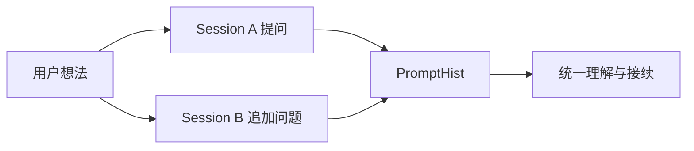

# vision

Session 只是算力入口，可多开并行。
PromptHist 作为统一记忆轨道，保证多线对话可追溯、可接续。

## 关键想法
- 当一个会话在思考时，可以直接开另一个会话继续提问
- 统一记录到 PromptHist 后，新会话能快速理解你已问过什么
- 结果是多线沟通、提高效率，但仍保持一致的上下文脉络

## 简化流程图

```mermaid
flowchart LR
  U[用户想法] --> S1[Session A 提问]
  U --> S2[Session B 追加问题]
  S1 --> P[PromptHist]
  S2 --> P
  P --> R[统一理解与接续]
```
